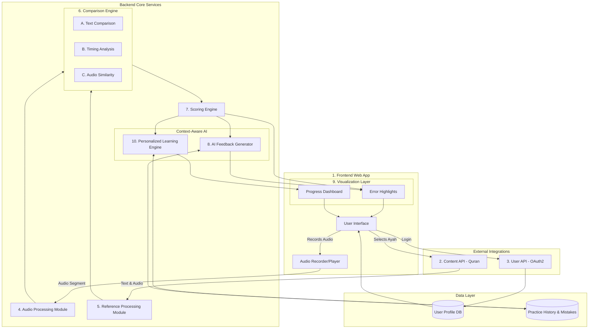
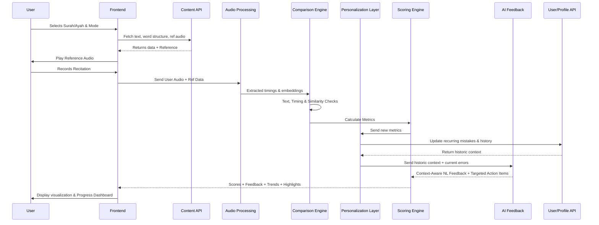

# Qari AI: System Architecture & Product Flow

## 📖 Learning Philosophy
**Qari AI** mimics traditional Quran learning methods by emphasizing listening and repetition. Instead of attempting complex, rigid tajweed rule detection, it focuses on guided imitation, timing alignment, and similarity feedback. This makes the system extremely practical, scalable, and user-friendly, helping users improve naturally through practice.

## 🎯 Core Concept Overview
The system acts as an AI-assisted Quran recitation coach designed around a guided **"Listen → Repeat → Compare → Improve"** learning loop. It evaluates recitations by approximating correctness using timing analysis, acoustic similarity embeddings, and basic speech recognition. 

---

## 🏗️ System Components & Architecture

### High-Level Architecture

### Component Details

1. **Frontend (Web App)**: Handles recording states (Listen → Record) and displays real-time visualizations (metrics, text highlights, dashboard).
2. **Content API Integration**: Uses the `@quranjs/api` SDK or explicit endpoints (e.g., `https://apis-prelive.quran.foundation/content/api/v4/chapters`) to fetch ayah text, word-level structure, and expert reference audio. Segments the ayah into trackable chunks. All requests require `x-auth-token` and `x-client-id` headers.
3. **Auth & User API Integration**: Authenticates via the OAuth2 Client Credentials flow (Server-to-Server) using `QF_CLIENT_ID` and `QF_CLIENT_SECRET` at `https://prelive-oauth2.quran.foundation`. The backend fetches a 1-hour access token and securely proxies all Quran API requests so the frontend never handles credentials directly.
4. **Audio Processing Module**: Runs an ASR model (e.g., Whisper) on user audio to transcribe speech, generate phoneme durations, and produce acoustic embeddings.
5. **Reference Processing Module**: Analyzes the reference audio exactly like the user's audio to create baseline embeddings and timing expectations.
6. **Comparison Engine**:
   - **Text**: Diff checks ASR output against Ayah text (missing/incorrect words).
   - **Timing (Madd)**: Compares normalized word duration bounds (`< 0.8` is too short, `> 1.2` is too long).
   - **Audio Similarity**: Computes cosine distance on embeddings.
7. **Scoring Engine**:
   - Final Score = `(0.5 × Accuracy) + (0.3 × Timing) + (0.2 × Similarity)`
8. **Context-Aware AI Feedback Generator**:
   - Takes error types and context, but also *historic performance trends* and *user level*.
   - Output example: *"You’ve improved compared to your last attempt! Try to stretch this specific word slightly longer to match the reciter."*
9. **Visualization Layer**:
   - Includes real-time error visualization (red = incorrect, yellow = timing).
   - **Progress Visualization**: Shows score trends over time, improvement percentage, "improvement streaks", and common mistakes via simple charts.
10. **🌟 Personalized Learning Engine**:
    - Tracks user-specific recurring mistakes (e.g., frequently mispronounced words, repeated madd shortening).
    - Generates personalized practice suggestions and recommends specific ayahs to target weaknesses. (e.g., *"You frequently shorten elongation in certain words. Practice these highlighted words to improve."*)

---

## 🔁 Complete Product Data Flow

## 🧠 Recitation Mode Adaptation

Supports different recitation pacing: **Hadr** (fast), **Tadwir** (medium), and **Tartil** (slow). Dynamic multipliers automatically scale the timing thresholds in the Comparison Engine based on the selected mode.

---

## 🚀 MVP Scope Definition

To ensure a high-impact, hackathon-ready delivery, the current scope is strictly bound:

**✅ Included in MVP:**
- Selection from a limited set of ayahs (e.g., Surah Al-Fatiha).
- Word-level guided recitation loop.
- Basic timing (madd) approximation and audio similarity scoring.
- OAuth login and user session/progress tracking.
- Context-aware AI feedback and personalized mistake tracking.

**❌ Explicitly Excluded from MVP:**
- Full, deterministic tajweed rule detection (ikhafa, idgham, etc. via strict phoneme rules).
- Deep phoneme-level acoustic model training.

---

## 🎬 Demo Strategy

The application flow for demonstration:
1. **Login & Dashboard**: User logs in via OAuth. The personalized dashboard shows past streaks and recurring mistakes.
2. **Setup**: User selects an ayah (e.g., Al-Fatiha, Ayah 1) and a recitation speed.
3. **Listen**: User presses play to hear the reference recitation.
4. **Practice**: User records their attempt.
5. **Analyze & Display**: 
   - The system highlights a missed word in **red** and a shortened madd in **yellow**.
   - The AI generates contextual feedback: *"You've improved from your last attempt! But you shortened the madd on 'Aalameen'. Try stretching it."*
6. **Progress Update**: The session is saved, and the dashboard visibly updates the improvement percentage and streak.
